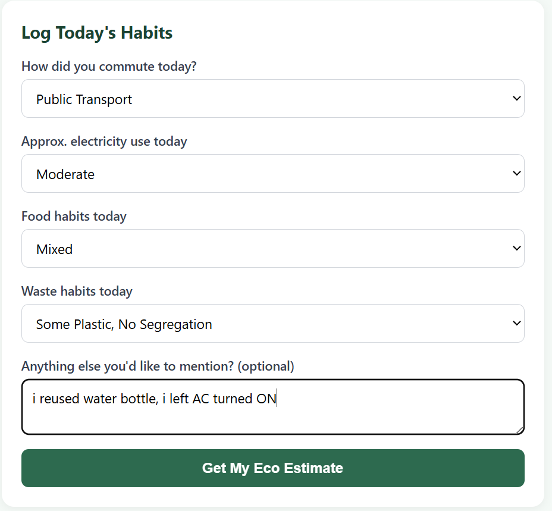
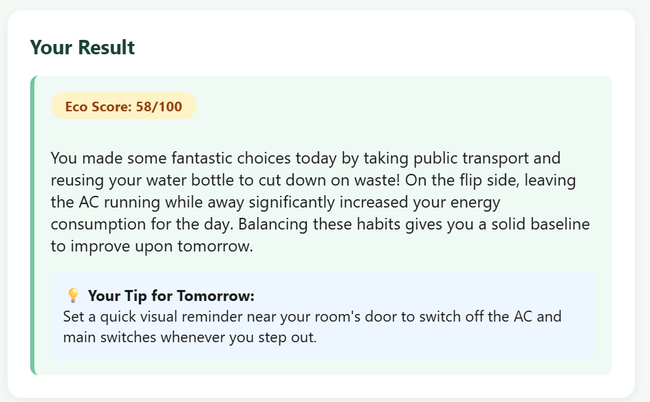
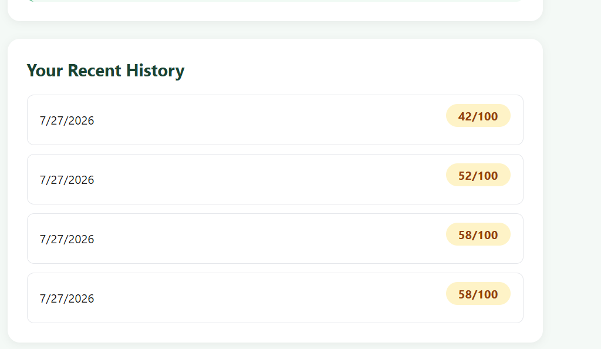

# 🌱 EcoTrack Campus

## a. What it does & the problem it solves
EcoTrack Campus is a daily sustainability habit tracker built for university students. Every day, students at Government College Women University, Sialkot make small choices — how they commute, how much electricity they use, what they eat, how they dispose of waste — that add up to a real environmental footprint, but most students never get feedback on these choices in a way that's fast, personal, and non-judgmental.

EcoTrack solves this by letting a student log their day in under a minute through a simple form. An AI coach then estimates an "Eco Score" for the day, explains it in plain language, and gives **one** specific, realistic tip for tomorrow — tailored to campus life in Pakistan, not generic advice copied from a Western blog.

**Who it's for:** university students who want to build more sustainable daily habits without a lecture — just quick, honest feedback.

## b. Live URL
🔗 **https://ecotrack-final.vercel.app**

## c. Features
- Daily habit logging across 4 categories: transport, electricity, food, waste
- Optional free-text notes for anything not covered by the dropdowns
- AI-generated Eco Score (0–100) for each day
- Personalized, encouraging summary of the day's impact
- One specific, actionable tip for the next day, targeted at the weakest habit area
- Local history of your last 10 entries with score badges (color-coded: green/yellow/red)
- Fully responsive, mobile-friendly interface
- No login required — works instantly for anyone who opens the link

## d. The AI Feature
**What it does:** Takes the student's logged habits and turns them into a fair, encouraging Eco Score plus one tailored tip — the AI reads the specific combination of habits (including free-text notes) and reasons about which behavior is most worth improving next.

**System prompt used** (also in `api/analyze.js`):

**Model used:** Google Gemini (`gemini-flash-latest`), via the Gemini API (free tier).

## e. Tools, services, and AI models used
- **Frontend:** HTML, CSS, vanilla JavaScript
- **Backend:** Vercel Serverless Functions (Node.js)
- **AI Model:** Google Gemini (`gemini-flash-latest`, via the free-tier Gemini API)
- **Hosting/Deployment:** Vercel
- **Version control:** Git & GitHub
- **Storage:** Browser localStorage (for habit history — no external database needed for this scope)

## f. Screenshots

## g. How to run this project locally

### Prerequisites
- Node.js installed
- A free Google Gemini API key (aistudio.google.com/apikey)
- Vercel CLI (optional, for local serverless function testing)

### Steps
Then add your `GEMINI_API_KEY` as an environment variable and open `http://localhost:3000`.

### Deploying your own copy
1. Push this repo to your own GitHub account (must be **public**).
2. Go to vercel.com, import the GitHub repo.
3. In Vercel project settings → Environment Variables, add:
   - `GEMINI_API_KEY` = your key
4. Deploy. Vercel will give you a live public URL.

---
Built as the Week 7 Final Project — Environmental Science, GCWUS.
